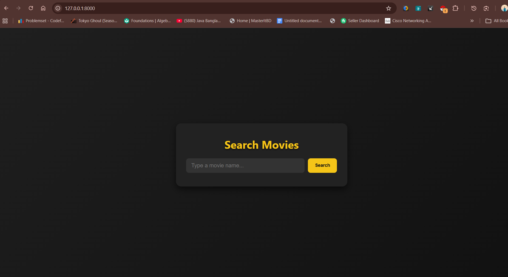
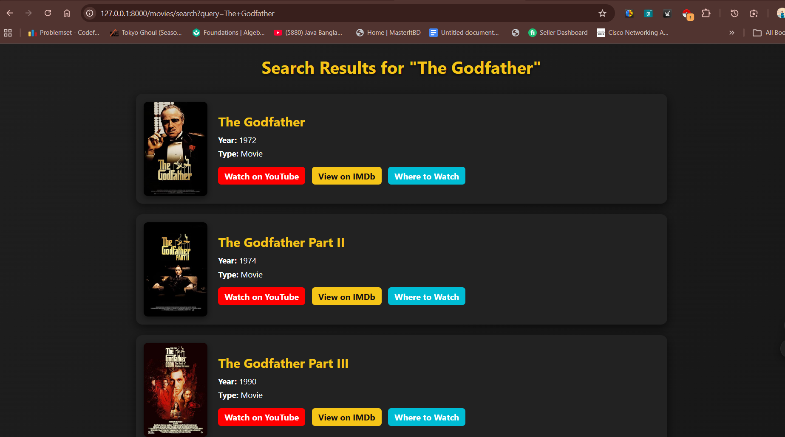
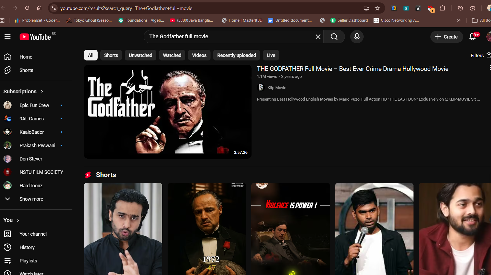

<p align="center"><a href="https://laravel.com" target="_blank"></a></p>

<p align="center">
<a href="https://github.com/laravel/framework/actions"></a>
<a href="https://packagist.org/packages/laravel/framework"></a>
<a href="https://packagist.org/packages/laravel/framework"></a>
<a href="https://packagist.org/packages/laravel/framework"></a>
</p>

🎬 Movie Search System

A web-based Movie Search System built with Laravel that allows users to search for movies and view detailed information using the OMDb API.

## 📖 Project Overview

The Movie Search System is designed to help users find movie information quickly and easily. By entering a movie title, users can retrieve real-time data including movie posters, ratings, release dates, genres, and plot summaries.

This project was developed to improve my skills in Laravel, API integration, web development, and database management.

---

## ✨ Features

- Search movies by title
- View movie posters
- Display movie ratings
- Show release date and genre
- View movie plot summaries
- Responsive user interface
- Real-time data from OMDb API

---

## 🛠 Technologies Used

- Laravel
- PHP
- MySQL
- HTML
- CSS
- Blade Template Engine
- OMDb API
- Git & GitHub

---

## 📷 Screenshots

### Home Page
<p align="center">
  
</p>

---

### Search Results
<p align="center">
  
</p>

---

### Movie Links Page
<p align="center">
  
</p>

---

## ⚙ Installation

### Clone the Repository

```bash
git clone https://github.com/yourusername/movie-search-system.git
```https://github.com/Ratul-007/Movie-Search-System

### Navigate to Project Directory

```bash
cd movie-search-system
```

### Install Dependencies

```bash
composer install
```


### Generate Application Key

```bash
php artisan key:generate
```

### Run the Project

```bash
php artisan serve
```

Visit:

```
http://127.0.0.1:8000
```

---

## 🚀 How It Works

1. User enters a movie title.
2. Laravel sends a request to the OMDb API.
3. The API returns movie information.
4. The system processes the data.
5. Results are displayed on the web page.

---

## 🎯 Learning Outcomes

Through this project I learned:

- Laravel MVC architecture
- API integration
- Environment configuration
- Route handling
- Blade templating
- GitHub version control
- Web application development

---

## 👨‍💻 Author

Ratul

LinkedIn: https://www.linkedin.com/in/ratul-das-b1807133a/

GitHub: https://github.com/Ratul-007

---

⭐ Support

If you like this project:

⭐ Star the repository
🍴 Fork it
📢 Share it


## 📄 License

This project is for educational and portfolio purposes.